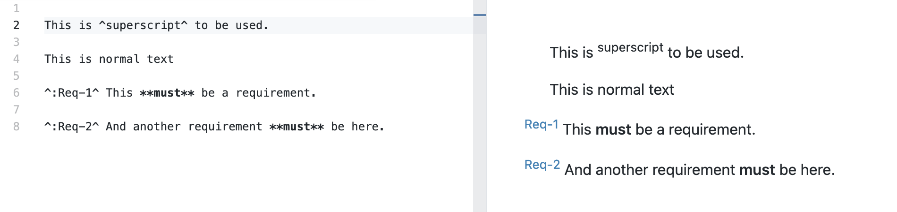

# VS Code Markdown Superscript Support

Adds superscript (`29^th^` => `29th`) support to VS Code Markdown preview.

In addition, adds the notation `^:ReqId^`, which is also superscript but styled as a requirement ID. The CSS dedents the label, and shows it in steel blue. This notation is intended to be used at the start of the line.

